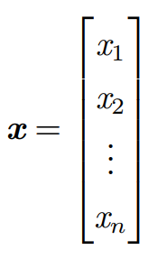
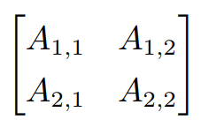

# 标量、向量、矩阵和张量
- **标量(Scalar)**: 一个标量就是一个单独的数
    - 标量一般使用斜体的小写变量表示，例如: $\textit{x}$
    - 使用标量时，一般会明确其具体的类型，比如，在定义实数标量时，$ \textit{s}\in R$ 表示一条线的斜率；在定义自然数标量时，$\textit{n} \in N$ 表示元素的数目

- **向量(Vector)**: 一个向量是一列数，这些数是有序排列的，通过次序中的索引，我们可以确定每个单独的数
    - 向量一般使用粗体的小写变量表示，例如: $\textbf{x}$
    - 向量中的元素一般使用带角标的斜体变量表示，例如: $\textit{x}_1$
    - 使用向量是 ，通常会明确其具体的类型，如果每个元素都属于 $R$，并且该向量有 $n$ 个元素，那么该向量属于实数集 $R$ 的 $n$ 次笛卡尔乘积构成的集合，记为: $R^n$
    - 当需要明确表示向量中的元素时，我们会将元素排列成一个方括号包围的纵列:

    - 可以把向量看作空间中的点，每个元素是不同坐标轴上的坐标

- **矩阵(matrix)**: 矩阵是一个二维数组，其中的每一个元素被两个索引所确定
    - 矩阵一般使用粗体大写变量表示，例如: $\textbf{A}$
    - 如果一个实数矩阵高度为 $m$，宽度为 $n$，那么我们说 $\textbf{A} \in R^{m \times n}$
    - 表示矩阵中的素时，通常以不加粗的斜体形式使用其名称，索引用逗号间隔，例如: ${A_{i,j}}$
    - 当需要明确表示矩阵中的元素时，我们将它们写在用方括号括起来的数组中:

- 张量(tensor): 一个数组中的元素分布在若干维坐标的规则网格中，我们称之为张量
    - 使用字体 $\mathbf{A}$ 表示张量
    - 张量 $\mathbf{A}$ 中坐标为 $(i,j,k)$ 的元素记作 $A_{i,j,k}$

